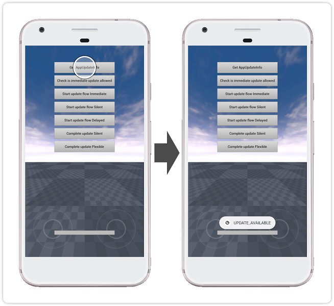
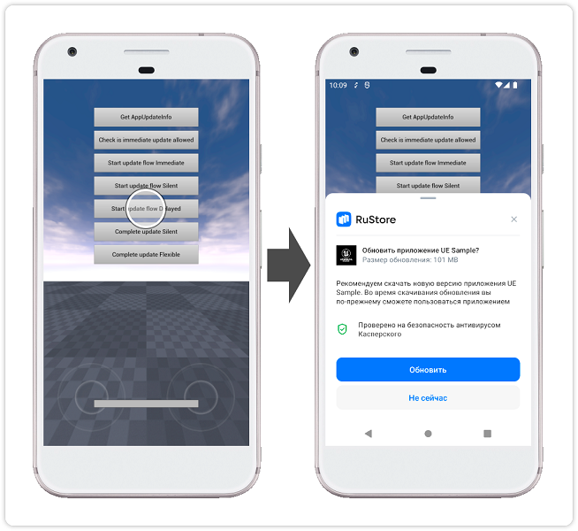
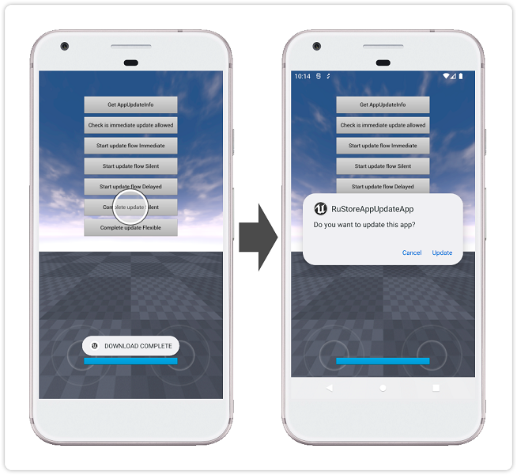

## RuStore Unreal Engine плагин для обновления приложения

### [🔗 Документация разработчика][10]

- [Условия работы SDK](#Условия-работы-SDK)
- [Подготовка требуемых параметров](#Подготовка-требуемых-параметров)
- [Настройка примера приложения](#Настройка-примера-приложения)
- [Сценарий использования](#Сценарий-использования)
- [Условия распространения](#Условия-распространения)
- [Техническая поддержка](#Техническая-поддержка)

### Условия работы SDK

Для работы RuStore In-app updates SDK необходимо соблюдение следующих условий:

1. ОС Android версии 7.0 или выше.

2. На устройстве пользователя установлен RuStore.

3. Актуальная версия RuStore на устройстве пользователя.

4. Приложению RuStore разрешена установка приложений.

### Подготовка требуемых параметров

1. `applicationId` - уникальный идентификатор приложения в системе Android в формате обратного доменного имени (пример: ru.rustore.sdk.example).

2. `*.keystore` - файл ключа, который используется для [подписи и аутентификации Android приложения](https://www.rustore.ru/help/developers/publishing-and-verifying-apps/app-publication/apk-signature/).

### Настройка примера приложения

1. В настройках проекта (Edit → Project Settings → Platforms → Android) в поле “Android Package Name” укажите `applicationId` - код приложения из консоли разработчика RuStore.

2. В настройках проекта (Edit → Project Settings → Platforms → Android) в разделе “Distribution Signing” укажите расположение и параметры ранее подготовленного файла `*.keystore`.

3. В настройках проекта (Edit → Project Settings → Platforms → Android) в поле “Store version” укажите код приложения. Значение кода должно быть ниже, чем значение кода приложения опубликованного в RuStore.

4. Выполните сборку проекта и проверьте работу приложения.

### Сценарий использования

#### Проверка наличия обновлений

Тап по кнопке `Get AppUpdateInfo` выполняет процедуру [проверки наличия обновлений][20].

#### Запуск скачивания обновления

Тап по кнопке `Start update flow Delayed` выполняет процедуру запуска сценария [отложенного обновления][30].

#### Установка обновления

Тап по кнопке `Complete update Silent` выполняет процедуру [тихого завершения обновления][40].

### Условия распространения

Данное программное обеспечение, включая исходные коды, бинарные библиотеки и другие файлы распространяется под лицензией MIT. Информация о лицензировании доступна в документе [MIT-LICENSE](MIT-LICENSE.txt).

### Техническая поддержка

Дополнительная помощь и инструкции доступны на странице [rustore.ru/help/](https://www.rustore.ru/help/) и по электронной почте [support@rustore.ru](mailto:support@rustore.ru).

[10]: https://www.rustore.ru/help/sdk/updates/unreal/7-0-0
[20]: https://www.rustore.ru/help/sdk/updates/unreal/7-0-0#checkavailable
[30]: https://www.rustore.ru/help/sdk/updates/unreal/7-0-0#scenariodelayedupdate
[40]: https://www.rustore.ru/help/sdk/updates/unreal/7-0-0#installupdatesilent
